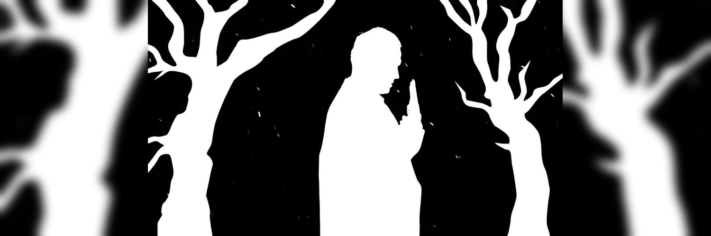

# $TIRED — I'm Tired of Web3

A complete, modern single-page website for the memecoin **$TIRED** ([@TiredOfWeb3](https://x.com/TiredOfWeb3) on X).

Dark cyberpunk aesthetic. Glitch effects. Matrix rain. An exhausted mascot everywhere. Zero corporate vibes.



## Features

- **Hero** — Glitching `$TIRED` logo, animated mascot with rotating quotes, BUY button (confetti + sad trombone), live Dexscreener chart + MCAP/liquidity
- **Manifesto** — Scrolling rant about Web3 fatigue with meme reaction cards
- **Tokenomics** — Visual cards with mascot reactions on hover
- **TIRED Agent** — Fake AI chat demo that roasts rugs in real-time
- **Roadmap** — Meme phases from "Tired Launch" to "Mars (maybe)"
- **Community** — Links, contract copy, fake testimonials
- **Vent Button** — Rant generator for when CT breaks you
- **Sound FX** — Tired sighs, keyboard typing, sad trombone (Web Audio API, no external files)
- **Effects** — Matrix code rain, scanlines, VHS flicker, neon glow, glitch text

## Tech Stack

- [Next.js 15+](https://nextjs.org/) (App Router)
- [Tailwind CSS v4](https://tailwindcss.com/)
- [Framer Motion](https://www.framer.com/motion/)
- [canvas-confetti](https://www.npmjs.com/package/canvas-confetti)

## Getting Started

### Prerequisites

- Node.js 18+
- npm, yarn, or pnpm

### Install & Run

```bash
# Clone or navigate to the project
cd tired-web

# Install dependencies
npm install

# Start dev server
npm run dev
```

Open [http://localhost:3000](http://localhost:3000).

### Production Build

```bash
npm run build
npm start
```

## Project Structure

```
src/
├── app/
│   ├── globals.css          # Cyberpunk theme, glitch/scanline CSS
│   ├── layout.tsx           # SEO metadata, fonts
│   └── page.tsx             # Main page assembly
├── components/
│   ├── effects/
│   │   ├── GlitchText.tsx   # RGB-split glitch headings
│   │   ├── MatrixRain.tsx   # Canvas matrix code background
│   │   └── Scanlines.tsx    # CRT scanline overlay
│   ├── mascot/
│   │   ├── Mascot.tsx       # Animated PFP with poses
│   │   └── MascotSpeech.tsx # Rotating quote bubbles
│   ├── sections/
│   │   ├── Hero.tsx
│   │   ├── Manifesto.tsx
│   │   ├── Tokenomics.tsx
│   │   ├── TiredAgent.tsx
│   │   ├── Roadmap.tsx
│   │   └── Community.tsx
│   └── ui/
│       ├── BuyButton.tsx    # Confetti + trombone CTA
│       ├── DexChart.tsx     # Dexscreener embed + live stats
│       ├── Nav.tsx
│       └── VentModal.tsx    # Rant generator modal
└── lib/
    ├── constants.ts         # Links, tokenomics, quotes
    ├── rants.ts             # Vent generator + manifesto text
    └── sounds.ts            # Web Audio sound effects
public/
└── images/
    ├── banner.jpg           # X account banner (1500x500)
    ├── mascot.gif           # X PFP mascot (full res)
    └── mascot-pfp.gif       # X PFP backup
```

## Configuration

Update token details in `src/lib/constants.ts`:

```ts
export const CONTRACT_ADDRESS = "4WzLp3sV5uReVvxatfYmxoJWH7fY65QZBbcSAF76pump";

export const LINKS = {
  x: "https://x.com/TiredOfWeb3",
  telegram: "https://t.me/tiredofweb3",
  dexscreener: `https://dexscreener.com/solana/${CONTRACT_ADDRESS}`,
  buy: `https://pump.fun/coin/${CONTRACT_ADDRESS}`,
};
```

## Assets

Mascot PFP and banner are pulled directly from [@TiredOfWeb3](https://x.com/TiredOfWeb3) on X:
- PFP: minimalist white silhouette leaning on a fence (cyber/emo vibe)
- Banner: 1500×500 profile banner

## SEO

Meta title: **"$TIRED — I'm Tired of Web3"**

OpenGraph and Twitter card images use the X banner.

## Disclaimer

This is a memecoin website. Not financial advice. Not medical advice. Just tired advice.

---

Stay tired. Stay real. Stay $TIRED.
